# Cars' Prices Comparision 🚗

Cars' price comparision.
The project scrapes data off car trading websites from different countries, converts value to the same valute (EUR Euros (€)) and predicts price for the incoming year.

Using:
- BeautifulSoup
- Python 3.7
- Sklearn
- Seaborn
- Matplotlib
- Pandas
- Currency_Converter
- data scraped off car trading website

Cars included in comparision:
- audi
- bmw
- fiat
- ford
- nissan
- opel
- peugeot
- renault
- skoda
- suzuki
- toyota
- volvo
- volkswagen

## Comparision time: late February 2020

Countries included in comparision:
- Poland
- Great Britain
- Germany
- United States
- The Netherlands

Websites used:
- otomoto.pl (Poland)
- autotrader.co.uk (Great Britain)
- autoscout24.com (German)
- auto.com (USA)
- trucksnl.com (The Netherlands)

You can browse and examine the scraped data in Excel (files named "cars_[CHOOSEN COUNTRY].csv").

## Graphs:

#### Mean price in EUR for a brand:
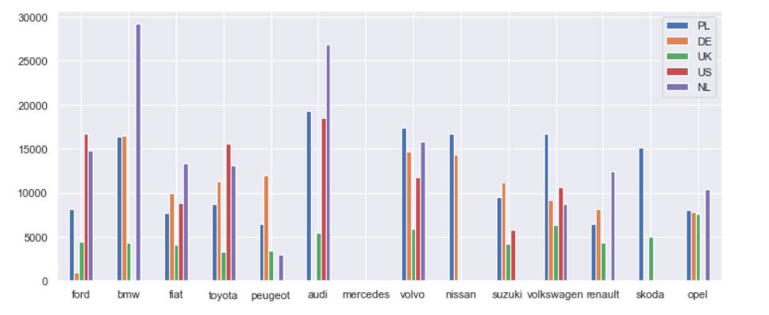

--------------------

#### Selected cars' price increase in years 1995-2020:
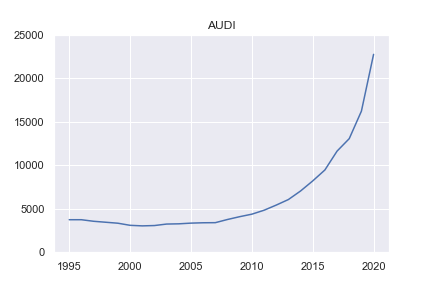

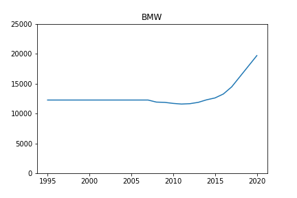

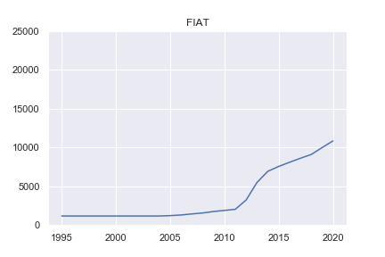

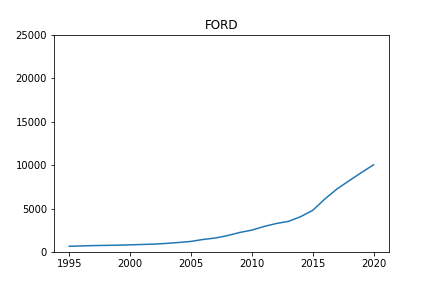

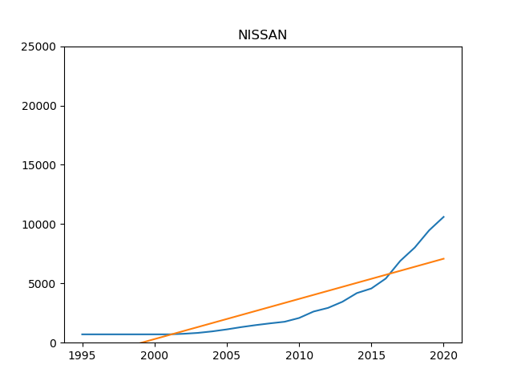

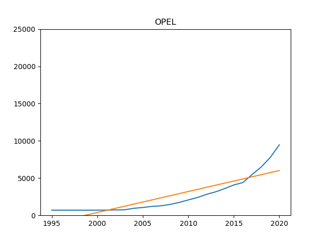

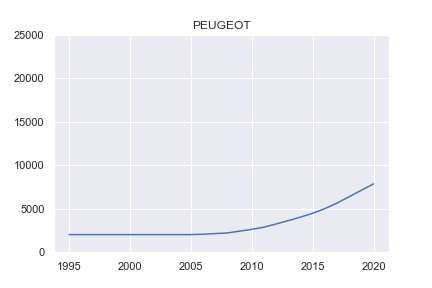

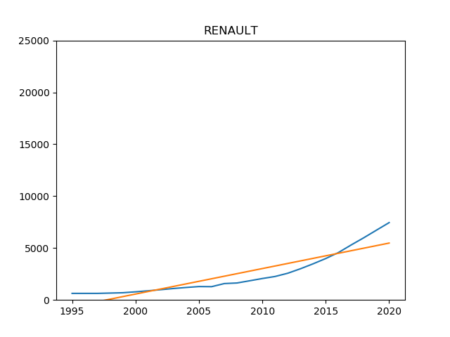

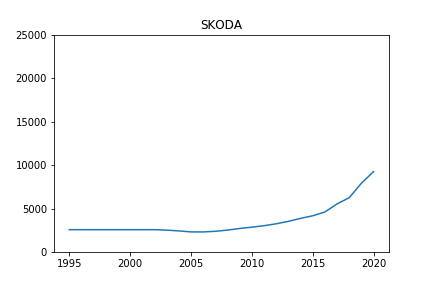

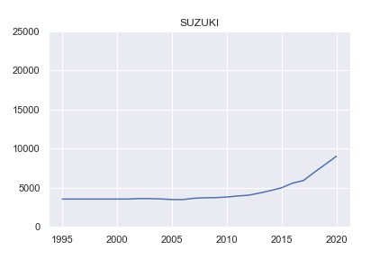

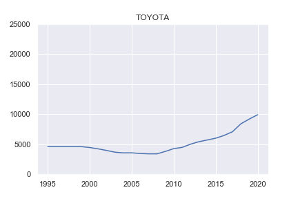

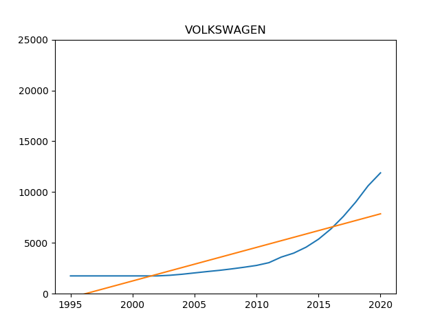

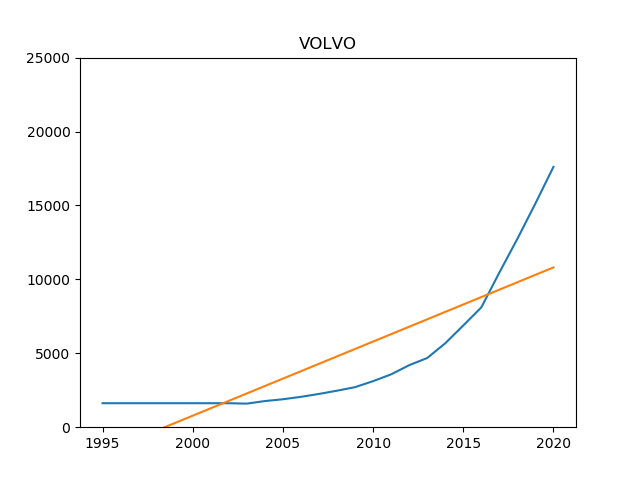
